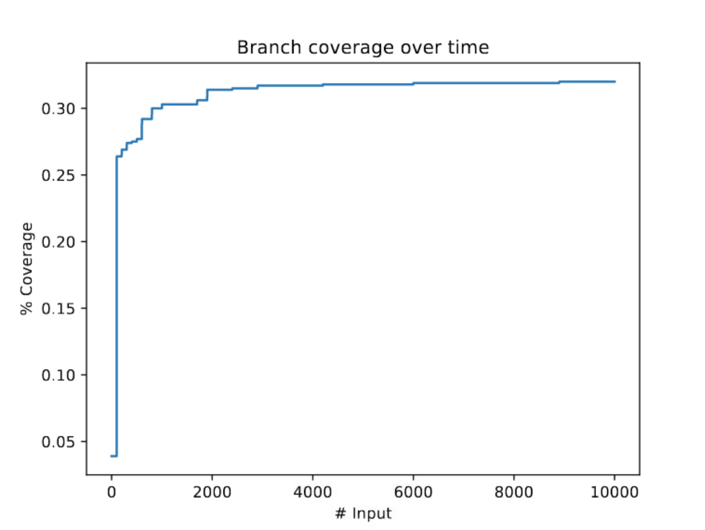
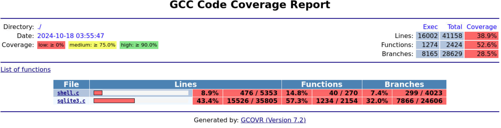

# fuzzing-SQLite

## Acknowledgement

This project is based on [an interactive exercise](https://jzamudio.com/sql-grammar-based-fuzzer/), presented to the audience at [the Fuzzing and Software Security Summer School](https://fuzzing.comp.nus.edu.sg/), and on [the Fuzzing Book](https://www.fuzzingbook.org/).

## Description

This project involves fuzz testing an old version of the SQLite database engine (version 3.31) to identify potential vulnerabilities or unexpected behaviour. The focus was on setting up and running automated fuzzing campaigns using various fuzzing tools and techniques to test the robustness of SQLite under abnormal or random input conditions.

## Features
- Integrated multiple fuzzing tools (e.g generation fuzzing, grammar fuzzing, mutation fuzzing) for automated testing
- Extensive input grammar for the SQL query language to achieve high code coverage for grammar fuzzing
- Comprehensive list of seed corpus and mutation operators for robust performance for mutation fuzzing
- Targeted fuzzing of SQLite's SQL statement handling and query execution logic
- Collected crash inputs for debugging and vulnerability analysis
- Modular and scriptable setup for reproducible testing

## Technologies Used
- C/C++
- SQLite
- AFL++ (American Fuzzy Lop Plus Plus)
- Linux shell scripting
- Git & Github
- Docker

## Prerequisites
- Git or Github (for team collaboration)
- Docker
- Python 3
- AFL++ installed

## Folder Structure
```
├── Dockerfile-Intel: Dockerfile for host computers with Intel CPUs
├── Dockerfile-Arm64: Dockerfile for host computers with Arm CPUs (e.g., Apple M1/M2/M3)
├── system: contains the system under test (SQLite), all the fuzzers, and running script (run_experiment.py)
│      └── grammar_fuzzer.py: a grammar-based fuzzer from the Fuzzing Book
│      └── grammar.py: to be updated by each group
│      └── mutation_fuzzer.py: a mutation-based fuzzer from the Fuzzing Book
│      └── run_experiment.py: script to run experiments 
│      └── seed-corpus: contains seed inputs for mutation-based fuzzing
│          └── seed1.dat: a sample seed input
│      └── *.c, *.h: source code of SQLite
│      └── Makefile: provides configurations to compile SQLite and do other things (e.g., folder cleaning)
└── results: contains bug-triggering inputs and other artifacts
└── group_info.txt: to be filled by each group
└── GroupAgreement.docx: to be filled by each group
└── README.md
└── images: images used in the README
```

## Setup Instructions
To building the program using Docker, build a 'ready-to-fuzz' Docker image by running the `docker build` command. Two version of Dockerfile are available: one for Intel CPUs and one for Arm64 CPUs.

For Intel CPUS:
```bash
docker build . -t name-of-program -f Dockerfile-Intel
```

For Arm64 CPUs:
```bash
docker build . -t name-of-program -f Dockerfile-Arm64
```

Next, start a Docker container. If the container starts properly, you should see a new container named `name-of-program-container` by running the `docker ps` command.

```bash
docker run -d --name name-of-program-container -p 6080:80 name-of-program
```

Access the Docker container in detached mode with the following command to enter the fuzzing program:
```
docker exec -it name-of-program-container /bin/bash
```

You can run the following command to fuzz SQLite using the provided fuzzers (grammar-based or mutation-based). Note that the keyword for python in Arm64 CPUs is **python3**, and **Python3.10** for Intel CPUs. The command below calculates the code coverage based on 1000 test inputs generated by `grammar_fuzzer.py`:
```
python3 run_experiment.py --fuzzer_type grammar_based --plot-every-x 100 --runs 1000
```

The command below runs the mutation-based fuzzer with or without code coverage guidance based on 1000 test inputs generated from the seed corpus `seed-corpus`:
```
python3 run_experiment.py --fuzzer_type mutation_based [--feedback_enabled] --corpus seed-corpus --plot-every-x 100 --runs 1000
```

Running the fuzzers will generate a plot showing the code coverage improvement over time, stored in `plot.pdf`. This can be viewed directly from the container by typing `localhost:6080` in your web browser, opening a web browser or PDF reader from the container, then opening the PDF file from there:



Run `make coverage-html` to open a detailed coverage report `coverage_report.html` file:

 

## Credits
- @khaifunglee
- @llrznhy
- @jincangku
- @NIANRANP

## Contributions
I contributed as a tooling lead, focusing on:
- Implemented bug detector components with AddressSanitizer
- Discovering vulnerabilities in SQLite by manipulating the grammar input or seed corpus to trigger specific known vulnerabilities in SQLite 3.31 (e.g CVE-2020-13434, CVE-2020-11656)
- Analyzing crash reports and interpreting crash inputs
- Assisting with documentation and configuring test automation scripts
